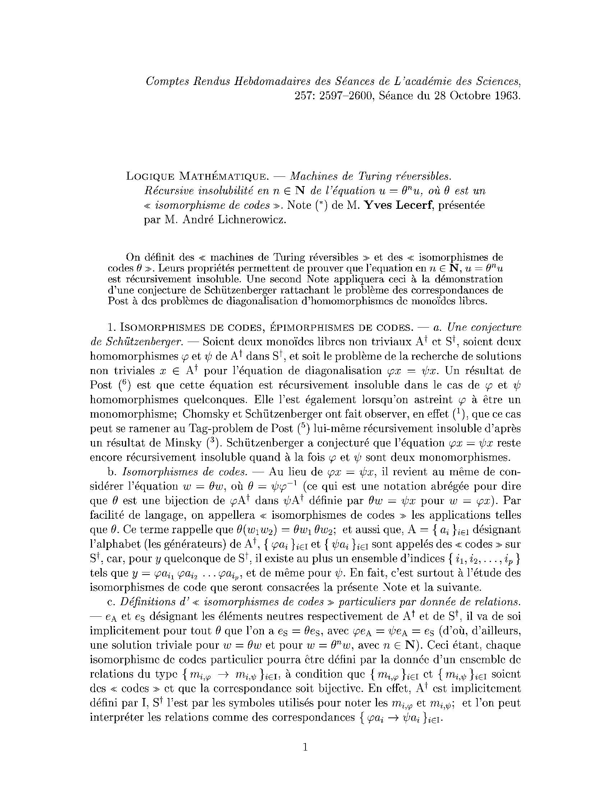
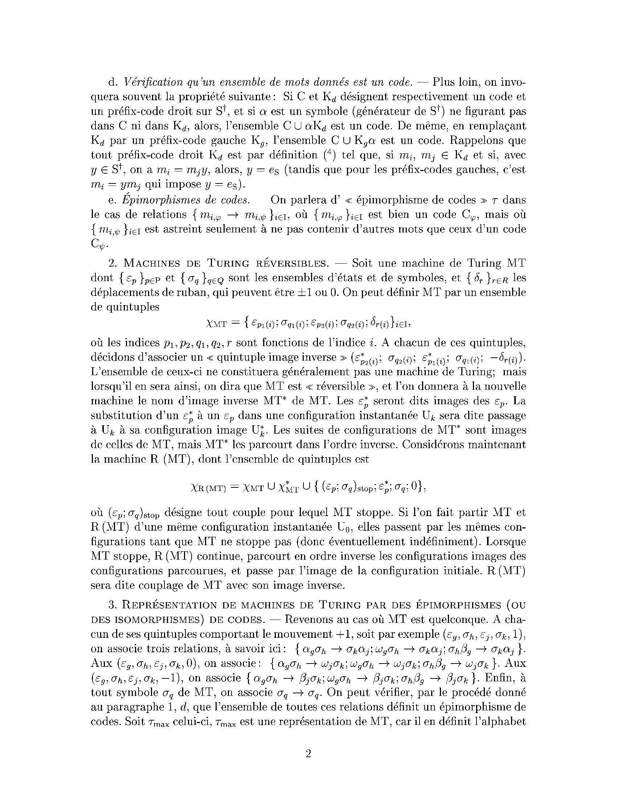
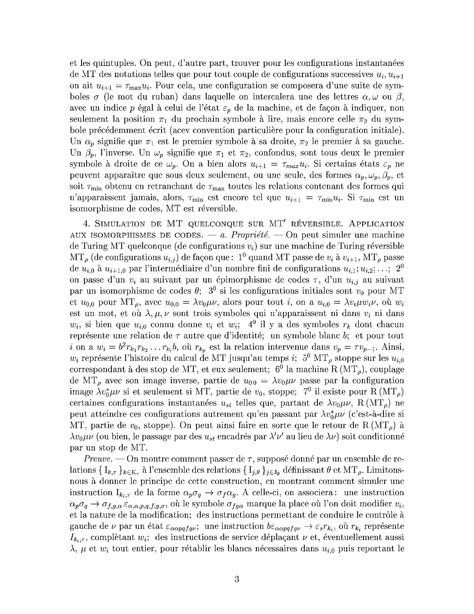
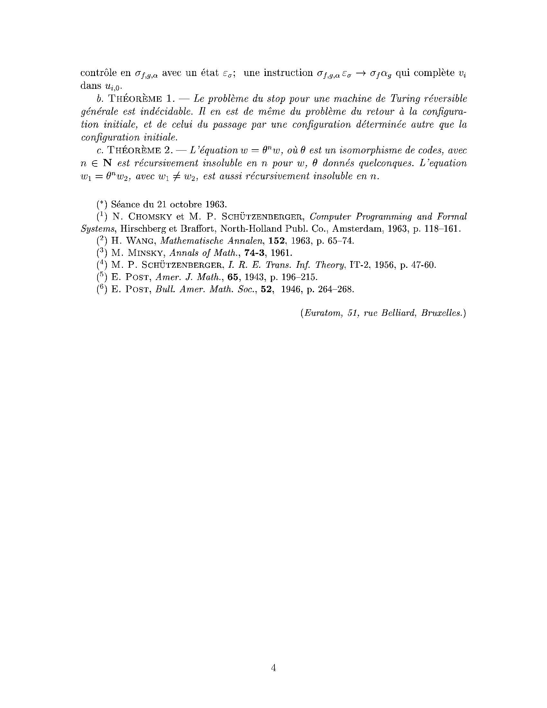

<!--
Transcription du PDF original. Les formules sont rendues en LaTeX et les
fac-similés de page se trouvent dans le sous-dossier images/.
-->

<!-- Page 1 -->

*Comptes Rendus Hebdomadaires des Séances de L'académie des Sciences,*  
**257: 2597-2600, Séance du 28 Octobre 1963.**

# Logique mathématique. — *Machines de Turing réversibles*

## *Récursive insolubilité en* $n \in \mathbf{N}$ *de l'équation* $u = \theta^n u$, *où* $\theta$ *est un « isomorphisme de codes »*

**Note (*) de M. Yves Lecerf, présentée par M. André Lichnerowicz.**

> On définit des « machines de Turing réversibles » et des « isomorphismes de codes $\theta$ ». Leurs propriétés permettent de prouver que l'équation en $n \in \mathbf{N}$, $u = \theta^n u$ est récursivement insoluble. Une seconde Note appliquera ceci à la démonstration d'une conjecture de Schützenberger rattachant le problème des correspondances de Post à des problèmes de diagonalisation d'homomorphismes de monoïdes libres.

## 1. Isomorphismes de codes, épimorphismes de codes

### a. *Une conjecture de Schützenberger*

Soient deux monoïdes libres non triviaux $A^\dagger$ et $S^\dagger$, soient deux homomorphismes $\varphi$ et $\psi$ de $A^\dagger$ dans $S^\dagger$, et soit le problème de la recherche de solutions non triviales $x \in A^\dagger$ pour l'équation de diagonalisation $\varphi x = \psi x$. Un résultat de Post (6) est que cette équation est récursivement insoluble dans le cas de $\varphi$ et $\psi$ homomorphismes quelconques. Elle l'est également lorsqu'on astreint $\varphi$ à être un monomorphisme; Chomsky et Schützenberger ont fait observer, en effet (1), que ce cas peut se ramener au Tag-problem de Post (5) lui-même récursivement insoluble d'après un résultat de Minsky (3). Schützenberger a conjecturé que l'équation $\varphi x = \psi x$ reste encore récursivement insoluble quand à la fois $\varphi$ et $\psi$ sont deux monomorphismes.

### b. *Isomorphismes de codes*

Au lieu de $\varphi x = \psi x$, il revient au même de considérer l'équation $w = \theta w$, où $\theta = \psi\varphi^{-1}$ (ce qui est une notation abrégée pour dire que $\theta$ est une bijection de $\varphi A^\dagger$ dans $\psi A^\dagger$ définie par $\theta w = \psi x$ pour $w = \varphi x$). Par facilité de langage, on appellera « isomorphismes de codes » les applications telles que $\theta$. Ce terme rappelle que $\theta(w_1w_2) = \theta w_1\,\theta w_2$; et aussi que, $A = \{a_i\}_{i\in I}$ désignant l'alphabet (les générateurs) de $A^\dagger$, $\{\varphi a_i\}_{i\in I}$ et $\{\psi a_i\}_{i\in I}$ sont appelés des « codes » sur $S^\dagger$; car, pour $y$ quelconque de $S^\dagger$, il existe au plus un ensemble d'indices $\{i_1,i_2,\ldots,i_p\}$ tels que $y = \varphi a_{i_1}\varphi a_{i_2}\cdots\varphi a_{i_p}$, et de même pour $\psi$. En fait, c'est surtout à l'étude des isomorphismes de code que seront consacrées la présente Note et la suivante.

### c. *Définitions d' « isomorphismes de codes » particuliers par donnée de relations*

$e_A$ et $e_S$ désignant les éléments neutres respectivement de $A^\dagger$ et de $S^\dagger$, il va de soi implicitement pour tout $\theta$ que l'on a $e_S = \theta e_S$, avec $\varphi e_A = \psi e_A = e_S$ (d'où, d'ailleurs, une solution triviale pour $w = \theta w$ et pour $w = \theta^n w$, avec $n \in \mathbf{N}$). Ceci étant, chaque isomorphisme de codes particulier pourra être défini par la donnée d'un ensemble de relations du type $\{m_{i,\varphi} \to m_{i,\psi}\}_{i\in I}$, à condition que $\{m_{i,\varphi}\}_{i\in I}$ et $\{m_{i,\psi}\}_{i\in I}$ soient des « codes » et que la correspondance soit bijective. En effet, $A^\dagger$ est implicitement défini par $I$, $S^\dagger$ l'est par les symboles utilisés pour noter les $m_{i,\varphi}$ et $m_{i,\psi}$; et l'on peut interpréter les relations comme des correspondances $\{\varphi a_i \to \psi a_i\}_{i\in I}$.

Fac-similé de la page 1

---

<!-- Page 2 -->

### d. *Vérification qu'un ensemble de mots donnés est un code*

Plus loin, on invoquera souvent la propriété suivante: Si $C$ et $K_d$ désignent respectivement un code et un préfix-code droit sur $S^\dagger$, et si $\alpha$ est un symbole (générateur de $S^\dagger$) ne figurant pas dans $C$ ni dans $K_d$, alors, l'ensemble $C \cup \alpha K_d$ est un code. De même, en remplaçant $K_d$ par un préfix-code gauche $K_g$, l'ensemble $C \cup K_g\alpha$ est un code. Rappelons que tout préfix-code droit $K_d$ est par définition (4) tel que, si $m_i,m_j \in K_d$ et si, avec $y \in S^\dagger$, on a $m_i = m_jy$, alors, $y = e_S$ (tandis que pour les préfix-codes gauches, c'est $m_i = ym_j$ qui impose $y = e_S$).

### e. *Épimorphismes de codes*

On parlera d' « épimorphisme de codes » $\tau$ dans le cas de relations $\{m_{i,\varphi} \to m_{i,\psi}\}_{i\in I}$, où $\{m_{i,\varphi}\}_{i\in I}$ est bien un code $C_\varphi$, mais où $\{m_{i,\psi}\}_{i\in I}$ est astreint seulement à ne pas contenir d'autres mots que ceux d'un code $C_\psi$.

## 2. Machines de Turing réversibles

Soit une machine de Turing $\mathrm{MT}$ dont $\{\varepsilon_p\}_{p\in P}$ et $\{\sigma_q\}_{q\in Q}$ sont les ensembles d'états et de symboles, et $\{\delta_r\}_{r\in R}$ les déplacements de ruban, qui peuvent être $\pm 1$ ou $0$. On peut définir $\mathrm{MT}$ par un ensemble de quintuples

$$
\chi_{\mathrm{MT}}
= \{\varepsilon_{p_1(i)};\,\sigma_{q_1(i)};\,\varepsilon_{p_2(i)};\,\sigma_{q_2(i)};\,\delta_{r(i)}\}_{i\in I},
$$

où les indices $p_1,p_2,q_1,q_2,r$ sont fonctions de l'indice $i$. A chacun de ces quintuples, décidons d'associer un « quintuple image inverse »

$$
(\varepsilon^*_{p_2(i)};\,\sigma_{q_2(i)};\,\varepsilon^*_{p_1(i)};\,\sigma_{q_1(i)};\,-\delta_{r(i)}).
$$

L'ensemble de ceux-ci ne constituera généralement pas une machine de Turing; mais lorsqu'il en sera ainsi, on dira que $\mathrm{MT}$ est « réversible », et l'on donnera à la nouvelle machine le nom d'image inverse $\mathrm{MT}^*$ de $\mathrm{MT}$. Les $\varepsilon_p^*$ seront dits images des $\varepsilon_p$. La substitution d'un $\varepsilon_p^*$ à un $\varepsilon_p$ dans une configuration instantanée $U_k$ sera dite passage à $U_k$ à sa configuration image $U_k^*$. Les suites de configurations de $\mathrm{MT}^*$ sont images de celles de $\mathrm{MT}$, mais $\mathrm{MT}^*$ les parcourt dans l'ordre inverse. Considérons maintenant la machine $\mathrm{R}(\mathrm{MT})$, dont l'ensemble de quintuples est

$$
\chi_{\mathrm{R}(\mathrm{MT})}
= \chi_{\mathrm{MT}} \cup \chi_{\mathrm{MT}}^*
  \cup \{(\varepsilon_p;\sigma_q)_{\mathrm{stop}};\,\varepsilon_p^*;\,\sigma_q;\,0\};
$$

où $(\varepsilon_p;\sigma_q)_{\mathrm{stop}}$ désigne tout couple pour lequel $\mathrm{MT}$ stoppe. Si l'on fait partir $\mathrm{MT}$ et $\mathrm{R}(\mathrm{MT})$ d'une même configuration instantanée $U_0$, elles passent par les mêmes configurations tant que $\mathrm{MT}$ ne stoppe pas (donc éventuellement indéfiniment). Lorsque $\mathrm{MT}$ stoppe, $\mathrm{R}(\mathrm{MT})$ continue, parcourt en ordre inverse les configurations images des configurations parcourues, et passe par l'image de la configuration initiale. $\mathrm{R}(\mathrm{MT})$ sera dite couplage de $\mathrm{MT}$ avec son image inverse.

## 3. Représentation de machines de Turing par des épimorphismes (ou des isomorphismes) de codes

Revenons au cas où $\mathrm{MT}$ est quelconque. A chacun de ses quintuples comportant le mouvement $+1$, soit par exemple $(\varepsilon_g,\sigma_h,\varepsilon_j,\sigma_k,1)$, on associe trois relations, à savoir ici:

$$
\{\alpha_g\sigma_h \to \sigma_k\alpha_j;\;
  \omega_g\sigma_h \to \sigma_k\alpha_j;\;
  \sigma_h\beta_g \to \sigma_k\alpha_j\}.
$$

Aux $(\varepsilon_g,\sigma_h,\varepsilon_j,\sigma_k,0)$, on associe:

$$
\{\alpha_g\sigma_h \to \omega_j\sigma_k;\;
  \omega_g\sigma_h \to \omega_j\sigma_k;\;
  \sigma_h\beta_g \to \omega_j\sigma_k\}.
$$

Aux $(\varepsilon_g,\sigma_h,\varepsilon_j,\sigma_k,-1)$, on associe

$$
\{\alpha_g\sigma_h \to \beta_j\sigma_k;\;
  \omega_g\sigma_h \to \beta_j\sigma_k;\;
  \sigma_h\beta_g \to \beta_j\sigma_k\}.
$$

Enfin, à tout symbole $\sigma_q$ de $\mathrm{MT}$, on associe $\sigma_q \to \sigma_q$. On peut vérifier, par le procédé donné au paragraphe 1, d, que l'ensemble de toutes ces relations définit un épimorphisme de codes. Soit $\tau_{\max}$ celui-ci, $\tau_{\max}$ est une représentation de $\mathrm{MT}$, car il en définit l'alphabet

Fac-similé de la page 2

---

<!-- Page 3 -->

et les quintuples. On peut, d'autre part, trouver pour les configurations instantanées de $\mathrm{MT}$ des notations telles que pour tout couple de configurations successives $u_i,u_{i+1}$ on ait $u_{i+1} = \tau_{\max}u_i$. Pour cela, une configuration se composera d'une suite de symboles $\sigma$ (le mot du ruban) dans laquelle on intercalera une des lettres $\alpha,\omega$ ou $\beta$, avec un indice $p$ égal à celui de l'état $\varepsilon_p$ de la machine, et de façon à indiquer, non seulement la position $\pi_1$ du prochain symbole à lire, mais encore celle $\pi_2$ du symbole précédemment écrit (acev convention particulière pour la configuration initiale). Un $\alpha_p$ signifie que $\pi_1$ est le premier symbole à sa droite, $\pi_2$ le premier à sa gauche. Un $\beta_p$, l'inverse. Un $\omega_p$ signifie que $\pi_1$ et $\pi_2$, confondus, sont tous deux le premier symbole à droite de ce $\omega_p$. On a bien alors $u_{i+1} = \tau_{\max}u_i$. Si certains états $\varepsilon_p$ ne peuvent apparaître que sous deux seulement, ou une seule, des formes $\alpha_p,\omega_p,\beta_p$, et soit $\tau_{\min}$ obtenu en retranchant de $\tau_{\max}$ toutes les relations contenant des formes qui n'apparaissent jamais, alors, $\tau_{\min}$ est encore tel que $u_{i+1} = \tau_{\min}u_i$. Si $\tau_{\min}$ est un isomorphisme de codes, $\mathrm{MT}$ est réversible.

## 4. Simulation de MT quelconque sur MT' réversible. Application aux isomorphismes de codes

### a. *Propriété*

On peut simuler une machine de Turing $\mathrm{MT}$ quelconque (de configurations $v_i$) sur une machine de Turing réversible $\mathrm{MT}_\rho$ (de configurations $u_{i,j}$) de façon que:

1. quand $\mathrm{MT}$ passe de $v_i$ à $v_{i+1}$, $\mathrm{MT}_\rho$ passe de $u_{i,0}$ à $u_{i+1,0}$ par l'intermédiaire d'un nombre fini de configurations $u_{i,1};u_{i,2};\ldots$;
2. on passe d'un $v_i$ au suivant par un épimorphisme de codes $\tau$, d'un $u_{i,j}$ au suivant par un isomorphisme de codes $\theta$;
3. si les configurations initiales sont $v_0$ pour $\mathrm{MT}$ et $u_{0,0}$ pour $\mathrm{MT}_\rho$, avec $u_{0,0} = \lambda v_0\mu\nu$, alors pour tout $i$, on a $u_{i,0} = \lambda v_i\mu w_i\nu$, où $w_i$ est un mot, et où $\lambda,\mu,\nu$ sont trois symboles qui n'apparaissent ni dans $v_i$ ni dans $w_i$, si bien que $u_{i,0}$ connu donne $v_i$ et $w_i$;
4. il y a des symboles $r_k$ dont chacun représente une relation de $\tau$ autre que d'identité; un symbole blanc $b$; et pour tout $i$ on a $w_i = b^2r_{k_1}r_{k_2}\cdots r_{k_i}b$, où $r_{k_p}$ est la relation intervenue dans $v_p = \tau v_{p-1}$. Ainsi, $w_i$ représente l'histoire du calcul de $\mathrm{MT}$ jusqu'au temps $i$;
5. $\mathrm{MT}_\rho$ stoppe sur les $u_{i,0}$ correspondant à des stop de $\mathrm{MT}$, et eux seulement;
6. la machine $\mathrm{R}(\mathrm{MT}_\rho)$, couplage de $\mathrm{MT}_\rho$ avec son image inverse, partie de $u_{00} = \lambda v_0\mu\nu$ passe par la configuration image $\lambda v_0^*\mu\nu$ si et seulement si $\mathrm{MT}$, partie de $v_0$, stoppe;
7. il existe pour $\mathrm{R}(\mathrm{MT}_\rho)$ certaines configurations instantanées $u_{st}$ telles que, partant de $\lambda v_0\mu\nu$, $\mathrm{R}(\mathrm{MT}_\rho)$ ne peut atteindre ces configurations autrement qu'en passant par $\lambda v_0^*\mu\nu$ (c'est-à-dire si $\mathrm{MT}$, partie de $v_0$, stoppe). On peut ainsi faire en sorte que le retour de $\mathrm{R}(\mathrm{MT}_\rho)$ à $\lambda v_0\mu\nu$ (ou bien, le passage par des $u_{st}$ encadrés par $\lambda'\nu'$ au lieu de $\lambda\nu$) soit conditionné par un stop de $\mathrm{MT}$.

*Preuve.* — On montre comment passer de $\tau$, supposé donné par un ensemble de relations $\{I_{k,\tau}\}_{k\in K_\tau}$, à l'ensemble des relations $\{I_{j,\theta}\}_{j\in J_\theta}$ définissant $\theta$ et $\mathrm{MT}_\rho$. Limitons-nous à donner le principe de cette construction, en montrant comment simuler une instruction $I_{k_i,\tau}$ de la forme $\alpha_p\sigma_q \to \sigma_f\alpha_g$. A celle-ci, on associera: une instruction

$$
\alpha_p\sigma_q
\to
\sigma_{f,g,\alpha}\varepsilon_{\alpha,\alpha,p,q,f,g,\sigma},
$$

où le symbole $\sigma_{fg\alpha}$ marque la place où l'on doit modifier $v_i$, et la nature de la modification; des instructions permettant de conduire le contrôle à gauche de $\nu$ par un état $\varepsilon_{\alpha\alpha pqfg\nu}$; une instruction $b\varepsilon_{\alpha\alpha pqfg\nu} \to \varepsilon_s r_{k_i}$, où $r_{k_i}$ représente $I_{k_i,\tau}$, complétant $w_i$; des instructions de service déplaçant $\nu$ et, éventuellement aussi $\lambda,\mu$ et $w_i$ tout entier, pour rétablir les blancs nécessaires dans $u_{i,0}$ puis reportant le

Fac-similé de la page 3

---

<!-- Page 4 -->

contrôle en $\sigma_{f,g,\alpha}$ avec un état $\varepsilon_\sigma$; une instruction $\sigma_{f,g,\alpha}\varepsilon_\sigma \to \sigma_f\alpha_g$ qui complète $v_i$ dans $u_{i,0}$.

### b. Théorème 1

*Le problème du stop pour une machine de Turing réversible générale est indécidable. Il en est de même du problème du retour à la configuration initiale, et de celui du passage par une configuration déterminée autre que la configuration initiale.*

### c. Théorème 2

*L'équation $w = \theta^n w$, où $\theta$ est un isomorphisme de codes, avec $n \in \mathbf{N}$ est récursivement insoluble en $n$ pour $w,\theta$ donnés quelconques. L'équation $w_1 = \theta^n w_2$, avec $w_1 \ne w_2$, est aussi récursivement insoluble en $n$.*

## Notes et références

(*) Séance du 21 octobre 1963.

1. N. Chomsky et M. P. Schützenberger, *Computer Programming and Formal Systems*, Hirschberg et Braffort, North-Holland Publ. Co., Amsterdam, 1963, p. 118-161.
2. H. Wang, *Mathematische Annalen*, **152**, 1963, p. 65-74.
3. M. Minsky, *Annals of Math.*, **74-3**, 1961.
4. M. P. Schützenberger, *I. R. E. Trans. Inf. Theory*, IT-2, 1956, p. 47-60.
5. E. Post, *Amer. J. Math.*, **65**, 1943, p. 196-215.
6. E. Post, *Bull. Amer. Math. Soc.*, **52**, 1946, p. 264-268.

*(Euratom, 51, rue Belliard, Bruxelles.)*

Fac-similé de la page 4

